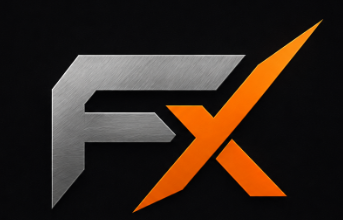
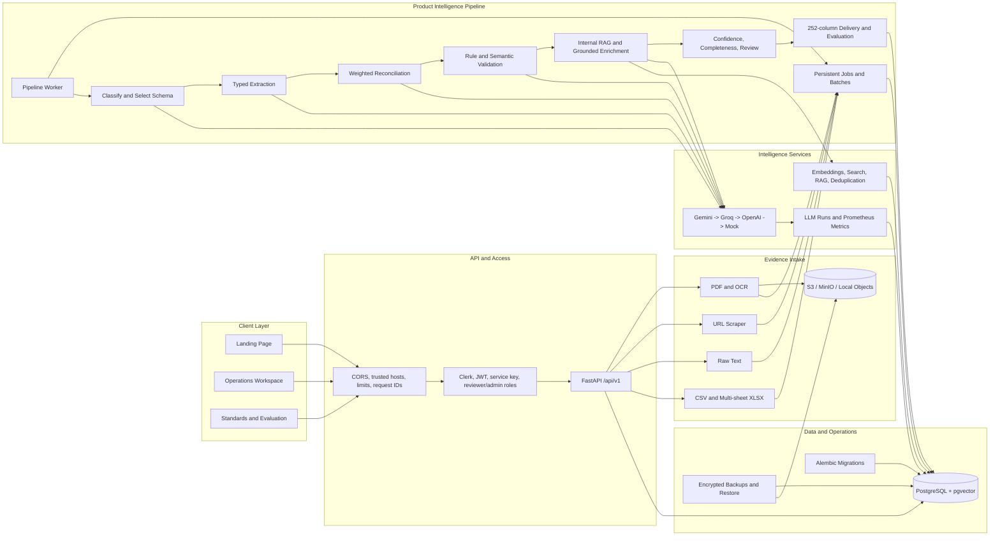

<p align="center">
  
</p>

<h1 align="center">Ferrox</h1>

<p align="center">
  <strong>Industrial product intelligence with field-level evidence.</strong><br />
  Convert PDFs, manufacturer pages, spreadsheets, and catalog text into validated, traceable product records.
</p>

<p align="center">
  <a href="https://github.com/praju455/Ferrox/actions/workflows/ci.yml"></a>
  
  
  
  
  
  
  
</p>

<p align="center">
  <a href="#overview">Overview</a> |
  <a href="#capabilities">Capabilities</a> |
  <a href="#architecture">Architecture</a> |
  <a href="#quick-start">Quick Start</a> |
  <a href="#api-contract">API</a> |
  <a href="#testing">Testing</a> |
  <a href="#deployment">Deployment</a>
</p>

---

## Overview

Industrial catalog teams rarely receive clean product data. Specifications arrive as PDFs, scanned sheets, supplier URLs, CSV/XLSX dumps, and inconsistent text. Ferrox turns those inputs into category-aware product records while preserving where every value came from.

The platform combines deterministic engineering rules with LLM-assisted classification, extraction, reconciliation, semantic validation, and grounded enrichment. Conflicts are never silently discarded: competing values, authority rankings, confidence, evidence, citations, and validation outcomes remain attached to the canonical field.

Ferrox includes:

- A **Next.js operations workspace** for ingestion, products, standards, reviews, batches, analytics, and system operations.
- A **FastAPI application** with typed contracts, role-based access, asynchronous jobs, and OpenAPI documentation.
- A **PostgreSQL + pgvector data layer** for product records, lineage, search, RAG, evaluation, and telemetry.
- A **worker process** for durable pipeline and batch execution.
- **Production topology** for API, worker, frontend, migrations, object storage, monitoring, and backups.

## Capabilities

| Area | What Ferrox provides |
| --- | --- |
| Ingestion | Native PDF, scanned-PDF OCR, URL, raw text, CSV/TSV/delimited text, and multi-sheet XLSX/XLSM ingestion. |
| PDF understanding | PyMuPDF text extraction, table boundaries, page lineage, adaptive Tesseract OCR, and relational row preservation. |
| Dynamic product schemas | LLM classification with category-specific schemas for pumps, bearings, motors, fasteners, and extensible industrial categories. |
| Structured extraction | Typed scalar, list, component, dimension, and relational-table values with confidence and source evidence. |
| Reconciliation | Source-authority and confidence-weighted voting, unit equivalence, alternatives, conflict status, and LLM tie-breaking. |
| Engineering validation | Pint-backed unit normalization, category ranges, cross-field checks, relational table checks, and semantic validation. |
| Enrichment | Internal catalog RAG first, then citation-backed Gemini Search restricted to approved manufacturer-owned domains. |
| Search and deduplication | pgvector embeddings, HNSW cosine search, semantic retrieval, internal RAG, and duplicate-product detection. |
| Human review | Review queue for conflicts, missing values, low confidence, validation failures, and possible duplicates. |
| Catalog delivery | Exact customer delivery schema learned from reference workbooks, including the 252-column format. |
| Content generation | Deterministic title, short, long, invoice, and mobile descriptions with UOM, fraction, casing, and length rules. |
| Quality evaluation | Reproducible 200-item ground-truth evaluation with field, LOV, manufacturer, taxonomy, and length metrics. |
| Operations | Persistent jobs, retryable batches, request IDs, LLM cost/latency telemetry, Prometheus metrics, backups, and restore tooling. |

## Processing Pipeline

1. **Ingest** raw evidence and retain its source, checksum, parser metadata, and object-storage key.
2. **Index** bounded document chunks and vectors for retrieval and duplicate detection.
3. **Classify** the product and select the relevant category schema.
4. **Extract** structured candidates per source with evidence and confidence.
5. **Reconcile** unit-equivalent candidates and preserve unresolved alternatives.
6. **Validate** values with engineering rules and semantic checks.
7. **Enrich** missing fields from internal or approved manufacturer-owned evidence.
8. **Score** confidence and completeness, then create review items where human judgment is needed.
9. **Deliver** the product through the configured customer schema and evaluate it against ground truth.

## Architecture



### Technology Stack

| Layer | Technology |
| --- | --- |
| Frontend | Next.js 14, React 18, TypeScript, Clerk |
| API | Python 3.11+, FastAPI, Pydantic v2, Uvicorn |
| Persistence | SQLAlchemy 2, Alembic, PostgreSQL 16, pgvector |
| Documents | PyMuPDF, Tesseract OCR, openpyxl, Beautiful Soup |
| Data quality | Pint, RapidFuzz, deterministic engineering rules |
| LLM providers | Gemini primary, Groq first fallback, OpenAI second fallback, deterministic mock for local tests |
| Storage | Private local filesystem or S3-compatible storage / MinIO |
| Observability | Prometheus metrics, persisted LLM run telemetry, structured request IDs |
| Delivery | Docker multi-stage images and Docker Compose |

## Quick Start

### Prerequisites

- Python 3.11 or newer
- Node.js 20 or newer and npm
- Docker with Docker Compose
- Tesseract OCR for scanned or image-only PDFs

On macOS, install Tesseract with:

```bash
brew install tesseract
```

### 1. Configure the project

```bash
git clone https://github.com/praju455/Ferrox.git
cd Ferrox

python3 -m venv .venv
.venv/bin/python -m pip install -e '.[dev]'

cp .env.example .env
cp frontend/.env.example frontend/.env.local
```

Set valid Clerk development keys for authenticated UI use:

- `CLERK_SECRET_KEY` in `.env`
- `NEXT_PUBLIC_CLERK_PUBLISHABLE_KEY` in `frontend/.env.local`

LLM keys are optional for local development. Without live keys, the deterministic mock provider keeps the pipeline and tests usable.

### 2. Start infrastructure and migrate

```bash
docker compose up -d postgres minio minio-init
.venv/bin/python -m alembic upgrade head
```

### 3. Start the application

Run each process in a separate terminal:

```bash
# API
.venv/bin/python -m uvicorn app.api:app --reload
```

```bash
# Pipeline and batch worker
.venv/bin/python -m app.worker
```

```bash
# Frontend
cd frontend
npm ci
npm run dev
```

### Local Services

| Service | URL |
| --- | --- |
| Ferrox frontend | [http://127.0.0.1:3000](http://127.0.0.1:3000) |
| API health | [http://127.0.0.1:8000/api/v1/health](http://127.0.0.1:8000/api/v1/health) |
| Swagger UI | [http://127.0.0.1:8000/docs](http://127.0.0.1:8000/docs) |
| ReDoc | [http://127.0.0.1:8000/redoc](http://127.0.0.1:8000/redoc) |
| Readiness probe | [http://127.0.0.1:8000/api/v1/health/ready](http://127.0.0.1:8000/api/v1/health/ready) |
| MinIO console | [http://127.0.0.1:9001](http://127.0.0.1:9001) |

### Seed Data and First Admin

```bash
# Seed 16 intentionally incomplete/conflicting industrial products
.venv/bin/python -m app.seed

# Uses BOOTSTRAP_ADMIN_EMAIL and BOOTSTRAP_ADMIN_PASSWORD from .env
.venv/bin/python -m app.bootstrap_admin
```

## Customer Reference Workflow

The **Standards** view and `/api/v1/reference-data` endpoints manage versioned customer master files. Supported dataset types are `manufacturer`, `lov`, `uom`, `fraction`, `faucets`, `fittings`, and `ground_truth`.

Recommended sequence:

1. Load manufacturer/brand, LOV, UOM, fraction, Faucets, and Fittings workbooks.
2. Load the 200-item input-versus-output workbook as `ground_truth`.
3. Import the source catalog through the workspace or `POST /api/v1/imports/catalog`.
4. Let the worker process queued products and run the product pipeline.
5. Generate deliveries with `POST /api/v1/products/{product_id}/delivery`.
6. Run `POST /api/v1/evaluations` and download the CSV evaluation report.

Customer reference files are intentionally not committed. Until a ground-truth delivery workbook is loaded, Ferrox returns a core preview schema with `quality.schema_ready=false`. After loading it, delivery records preserve the workbook's exact column names and enforce the expected 252-column width.

## API Contract

The complete interactive contract is available through Swagger UI at `/docs`. All application routes use the `/api/v1` prefix.

| Domain | Primary endpoints |
| --- | --- |
| Health and metrics | `GET /health`, `GET /health/live`, `GET /health/ready`, `GET /metrics` |
| Authentication | `POST /auth/token`, `GET /auth/me` |
| Users | `POST /users`, `GET /users`, `PATCH /users/{user_id}` |
| Products | `POST /products`, `GET /products`, `GET/DELETE /products/{product_id}` |
| Sources | `POST /products/{id}/sources/{text\|url\|pdf}`, `GET /products/{id}/sources` |
| Pipeline | `POST /products/{id}/pipeline`, `POST /products/{id}/pipeline/jobs`, `GET /pipeline/jobs` |
| Reviews | `GET/PATCH /reviews/{review_id}`, `PATCH /products/{id}/fields/{field_name}` |
| Batches and imports | `POST/GET /batches`, `POST /imports/catalog` |
| Search and RAG | `GET /search/semantic`, `GET /products/{id}/duplicates`, `POST /rag/query` |
| Reference masters | `POST/GET /reference-data`, `GET /reference-data/{dataset_id}` |
| Delivery and evaluation | `POST/GET /products/{id}/delivery`, `POST/GET /evaluations` |
| Analytics | `GET /analytics/catalog`, `GET /analytics/catalog.csv` |
| Observability | `GET /observability/llm-runs` |

### Extracted Field Shape

Every canonical field retains evidence and competing candidates:

```json
{
  "field_name": "flow_rate",
  "value": "120",
  "unit": "GPM",
  "confidence": 0.96,
  "source_id": "source-uuid",
  "status": "validated",
  "evidence": "Rated capacity: 120 US GPM",
  "alternatives": [
    {
      "value": "110",
      "unit": "GPM",
      "confidence": 0.78,
      "source_id": "other-source-uuid",
      "authority_rank": 3
    }
  ],
  "validation": {
    "valid": true,
    "rule_issues": [],
    "semantic_issues": []
  }
}
```

### Authentication and Roles

| Principal | Access |
| --- | --- |
| Reviewer | Products, ingestion, pipelines, batches, references, search, analytics, and review workflows. |
| Admin | Reviewer access plus user management, reference uploads, reindexing, and LLM telemetry. |
| Service client | Automation through `X-API-Key` when `INTERNAL_API_KEY` is configured. |

The browser sends a Clerk bearer token. The API also supports Ferrox JWTs issued by `POST /auth/token`. Production refuses to start without Clerk or JWT authentication configured.

## Configuration

All secrets and deployment settings come from environment variables. Never commit `.env` or `frontend/.env.local`. See [`.env.example`](.env.example) for the complete backend contract and [`frontend/.env.example`](frontend/.env.example) for browser-visible settings.

| Group | Important variables |
| --- | --- |
| Application | `APP_ENV`, `API_V1_PREFIX`, `CORS_ORIGINS`, `TRUSTED_HOSTS` |
| Database and auth | `DATABASE_URL`, `CLERK_SECRET_KEY`, `JWT_SECRET`, `INTERNAL_API_KEY` |
| LLM routing | `LLM_PROVIDER_ORDER`, `GEMINI_API_KEY`, `GROQ_API_KEY`, `OPENAI_API_KEY` |
| Grounding | `ENABLE_GROUNDED_ENRICHMENT`, `MANUFACTURER_DOMAIN_ALLOWLIST` |
| Documents | `ENABLE_PDF_OCR`, `PDF_OCR_*`, `DOCUMENT_CHUNK_*`, upload-size limits |
| Vectors | `EMBEDDING_MODEL`, `EMBEDDING_DIMENSIONS`, `DUPLICATE_SIMILARITY_THRESHOLD` |
| Delivery | `DELIVERY_EXPECTED_COLUMNS`, reference upload limits |
| Object storage | `OBJECT_STORAGE_BACKEND`, `LOCAL_STORAGE_PATH`, `S3_*` |
| Operations | `WORKER_POLL_SECONDS`, `BACKUP_*`, provider token-cost settings |
| Frontend | `NEXT_PUBLIC_API_BASE`, `NEXT_PUBLIC_CLERK_PUBLISHABLE_KEY` |

### LLM Failover

The default order is deliberate:

| Priority | Provider | Use |
| --- | --- | --- |
| 1 | Gemini | Primary JSON extraction, classification, semantic tasks, and search grounding. |
| 2 | Groq | First fallback using OpenAI-compatible JSON chat completions. |
| 3 | OpenAI | Second fallback using JSON chat completions. |
| Local | Mock | Deterministic, no-cost behavior for tests and development without provider keys. |

Malformed outputs are parsed defensively, contract-validated, retried, and then passed to the next configured provider. Every provider attempt records status, model, latency, tokens, estimated cost, and bounded error context.

## Testing

```bash
# Backend unit and integration suite
.venv/bin/python -m pytest

# Frontend quality and production compilation
cd frontend
npm run lint
npm run build
```

Latest verified local result:

```text
79 passed, 4 skipped
ESLint: no warnings or errors
Next.js production build: passed
```

The skipped tests are opt-in PostgreSQL and billable live-provider suites. GitHub Actions runs PostgreSQL migration/constraint checks automatically. The **Live LLM Integration** workflow is manual and requires Gemini, Groq, and OpenAI repository secrets.

## Deployment

The production Compose topology includes release migrations, API, worker, frontend, PostgreSQL/pgvector, private MinIO, Prometheus, and scheduled encrypted database backups.

```bash
docker compose -f docker-compose.production.yml up -d --build
```

Before deployment, provide strong values for `POSTGRES_PASSWORD`, `JWT_SECRET`, S3 credentials, and enabled LLM providers through a secret manager. Put TLS ingress in front of ports 3000 and 8000; do not expose PostgreSQL, MinIO, or Prometheus publicly.

See the [deployment runbook](ops/DEPLOYMENT.md) for release checks, monitoring, immediate backups, guarded restore commands, and recovery drills.

## Repository Layout

```text
Ferrox/
|-- app/                            FastAPI application, services, models, worker
|-- frontend/                       Next.js and TypeScript web application
|-- migrations/                     Alembic migration history
|-- tests/                          Backend, PostgreSQL, evaluation, and LLM tests
|-- ops/                            Prometheus configuration and deployment runbook
|-- .github/workflows/              CI and manual live-provider verification
|-- docker-compose.yml              Local PostgreSQL and MinIO infrastructure
|-- docker-compose.production.yml   Complete production topology
|-- Dockerfile                      Backend production image
|-- pyproject.toml                  Python package and test configuration
`-- .env.example                    Backend environment contract
```

## Troubleshooting

### PostgreSQL driver is missing

Run project commands with the project virtual environment, not the global Python installation:

```bash
.venv/bin/python -m pip install -e '.[dev]'
.venv/bin/python -m app.worker
```

### Frontend returns a missing chunk error

Stop the development server, remove the generated `frontend/.next` directory, and restart `npm run dev`. Do not run `npm run build` while `npm run dev` is using the same `.next` directory.

### Workspace redirects to sign-in

Confirm that `NEXT_PUBLIC_CLERK_PUBLISHABLE_KEY` is configured in `frontend/.env.local` and the matching `CLERK_SECRET_KEY` is configured in `.env`. OAuth callbacks are handled by the catch-all `/login/[[...sign-in]]` route.

### API is running but jobs do not progress

The API and worker are separate processes. Start the worker with:

```bash
.venv/bin/python -m app.worker
```

## Security Notes

- Uploaded objects remain private and are streamed through authenticated API routes.
- URL ingestion blocks private-network targets to reduce SSRF exposure.
- Request sizes, PDF uploads, reference files, and catalog row counts are bounded.
- Production uses trusted-host and CORS allowlists, role checks, request IDs, and security headers.
- Grounded enrichment rejects marketplace, distributor, reseller, and unapproved-domain citations.
- Secrets belong in the deployment secret manager, never in Git history.

---

<p align="center">
  <strong>Ferrox</strong> - industrial product data that can explain where every field came from.
</p>
