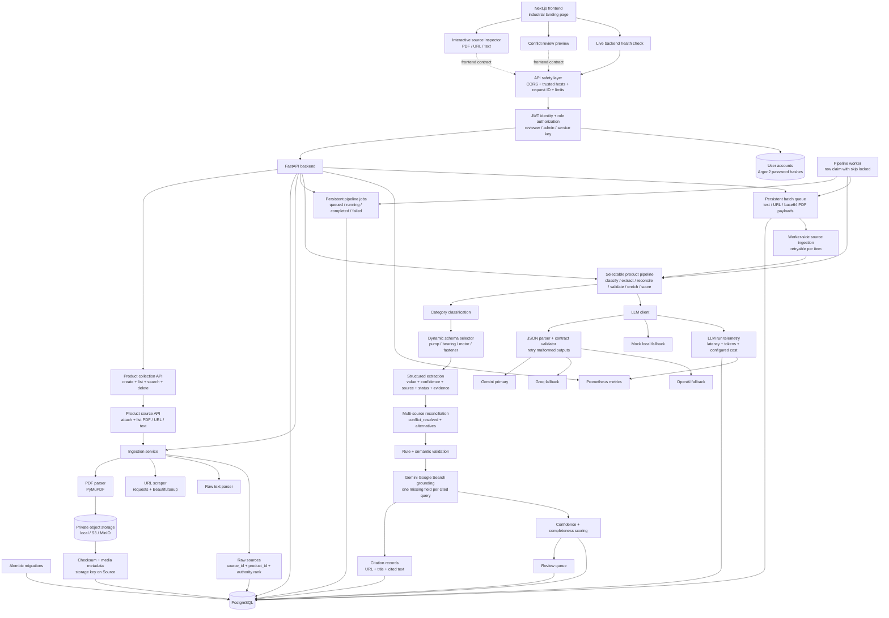

# Ferrox

Backend and frontend for the **Industrial Product Intelligence Platform**: a system that converts scattered industrial product information from PDFs, URLs, and raw catalog text into traceable, validated, enriched structured product data.

The backend lives in `app/`. The frontend landing page and future app shell live in `frontend/` as a Next.js + TypeScript project.

## Frontend Direction

The landing page now uses an industrial inspection visual system derived from selected layouts in the local `front/` design catalog. It includes a generated centrifugal-pump hero image, an interactive PDF/URL/text source inspector, a full extraction pipeline, canonical record evidence, conflict review, the API contract, and a live backend health check. The catalog remains local and ignored; only original Ferrox frontend code is committed to this repository.

## Backend Status

Implemented stages:

1. FastAPI scaffold with SQLAlchemy models for products, raw sources, extracted fields, review queue, and batch jobs.
2. PDF, URL, and raw text ingestion services.
3. LLM pipeline abstraction with live Gemini primary, Groq fallback, OpenAI fallback, and deterministic mock fallback for local tests.
4. Category classification, predefined dynamic schemas, and structured extraction.
5. Multi-source reconciliation with explicit conflict handling and source authority ranking.
6. Rule validation plus semantic LLM validation hook.
7. Grounded enrichment hook.
8. Confidence/completeness scoring and review queue creation.
9. Batch ingestion and processing.
10. Seed data for 16 industrial products with incomplete and conflicting source snippets.
11. Alembic migration setup with an initial PostgreSQL schema migration.
12. API hardening with production API-key enforcement, CORS allowlisting, trusted hosts, request IDs, body/upload limits, security headers, and private-network URL blocking.
13. Product collection and source evidence APIs so PDF, URL, and text sources can share one product record.
14. Selectable pipeline stages with retry-safe candidate extraction and idempotent review queue creation.
15. Persistent pipeline jobs with queued/running/completed/failed states and a separate database-backed worker.
16. Durable PDF storage through a local development backend or private S3-compatible storage, including MinIO, checksums, and download streaming.
17. Truly asynchronous batch jobs with worker-side text, public URL, and base64 PDF ingestion plus retryable item failures.
18. Citation-backed Gemini Google Search enrichment that persists only grounded missing-field values and their source URLs.
19. LLM run telemetry with provider fallback attempts, model/task latency, token usage, configurable cost estimates, and Prometheus metrics.
20. User accounts with expiring JWT access tokens, Argon2 password hashing, reviewer/admin authorization, inactive-account enforcement, and service API-key compatibility.

## Local Setup

```bash
python3 -m venv .venv
.venv/bin/python -m pip install -e '.[dev]'
cp .env.example .env
docker compose up -d postgres minio minio-init
.venv/bin/python -m alembic upgrade head
.venv/bin/python -m uvicorn app.api:app --reload
```

The API will be available at `http://127.0.0.1:8000`.

Run the pipeline worker in a second terminal:

```bash
.venv/bin/python -m app.worker
```

Health check:

```bash
curl http://127.0.0.1:8000/api/v1/health
```

To seed mock industrial products:

```bash
.venv/bin/python -m app.seed
```

Create or reset the first administrator after setting `BOOTSTRAP_ADMIN_EMAIL` and `BOOTSTRAP_ADMIN_PASSWORD`:

```bash
.venv/bin/python -m app.bootstrap_admin
```

To create a future migration after model changes:

```bash
.venv/bin/python -m alembic revision --autogenerate -m "describe change"
.venv/bin/python -m alembic upgrade head
```

To run tests:

```bash
.venv/bin/python -m pytest
```

To run the frontend UI:

```bash
cd frontend
npm install
npm run dev
```

The frontend runs at `http://127.0.0.1:3000` and defaults to `http://127.0.0.1:8000/api/v1` for the backend API.

## Environment

All secrets are read from environment variables. Do not commit `.env`.

| Variable | Purpose |
| --- | --- |
| `DATABASE_URL` | Primary PostgreSQL SQLAlchemy URL. |
| `TEST_DATABASE_URL` | Test database URL; defaults to in-memory SQLite for fast tests. |
| `INTERNAL_API_KEY` | Optional API key for mutating endpoints. Leave blank for local-only development. |
| `JWT_SECRET` | Signing secret for user access tokens. Required in production. |
| `JWT_ISSUER` / `JWT_AUDIENCE` | Token issuer and intended API audience. |
| `ACCESS_TOKEN_EXPIRE_MINUTES` | JWT lifetime. Default: 480 minutes. |
| `BOOTSTRAP_ADMIN_EMAIL` / `BOOTSTRAP_ADMIN_PASSWORD` | One-time administrator bootstrap inputs. |
| `LLM_PROVIDER_ORDER` | Comma-separated provider order. Default: `gemini,groq,openai`. |
| `GEMINI_API_KEY` | Primary LLM provider key. |
| `GROQ_API_KEY` | First fallback provider key. |
| `OPENAI_API_KEY` | Second fallback provider key. |
| `GEMINI_MODEL` | Gemini model name. Default: `gemini-2.5-flash`. |
| `GROQ_MODEL` | Groq chat model name. Default: `llama-3.3-70b-versatile`. |
| `OPENAI_MODEL` | OpenAI chat model name. Default: `gpt-4o-mini`. |
| `ENABLE_GROUNDED_ENRICHMENT` | Enables live Google Search grounding for missing required fields. |
| `GEMINI_GROUNDING_MODEL` | Gemini model used with the Google Search tool. |
| `*_INPUT_COST_PER_MILLION` / `*_OUTPUT_COST_PER_MILLION` | Deployment-owned price inputs used for estimated cost telemetry. |
| `SCRAPER_TIMEOUT_SECONDS` | URL scrape timeout. |
| `MAX_SOURCE_CHARS` | Maximum retained source text per source. |
| `MAX_REQUEST_BYTES` | Maximum accepted HTTP request size. Default: 25 MB. |
| `MAX_PDF_UPLOAD_BYTES` | Maximum accepted PDF payload. Default: 20 MB. |
| `OBJECT_STORAGE_BACKEND` | `local` for filesystem development or `s3` for S3/MinIO. |
| `LOCAL_STORAGE_PATH` | Private local object directory used by the local backend. |
| `S3_BUCKET` / `S3_ENDPOINT_URL` | S3 bucket and optional S3-compatible endpoint. |
| `S3_ACCESS_KEY_ID` / `S3_SECRET_ACCESS_KEY` | S3 credentials; leave unset to use the AWS credential chain. |
| `S3_SERVER_SIDE_ENCRYPTION` | Server-side encryption mode used for stored PDFs. |
| `CORS_ORIGINS` | Comma-separated frontend origins allowed to call the API. |
| `TRUSTED_HOSTS` | Comma-separated HTTP host allowlist. |
| `WORKER_POLL_SECONDS` | Pipeline worker polling interval. Default: 2 seconds. |

LLM calls are routed in `LLM_PROVIDER_ORDER`. Each provider is asked for JSON only, parsed defensively, validated against the task contract, retried on malformed output, and then falls through to the next provider if it still fails. If no live keys are configured, the deterministic mock provider keeps local tests and demos working without secrets.

Provider behavior:

| Provider | API style |
| --- | --- |
| Gemini | `generateContent` with `responseMimeType: application/json`. |
| Groq | OpenAI-compatible chat completions with `response_format: {"type": "json_object"}`. |
| OpenAI | Chat completions with `response_format: {"type": "json_object"}`. |

Human users authenticate with `POST /api/v1/auth/token` and send:

```text
Authorization: Bearer your-jwt
```

`reviewer` accounts can use catalog, ingestion, pipeline, batch, and review APIs. `admin` accounts additionally manage users and inspect LLM telemetry. Automation can still use:

```text
X-API-Key: your-service-key
```

Production mode (`APP_ENV=production`) refuses to start without `JWT_SECRET`. Every response includes `X-Request-ID`, and clients may send their own request ID for end-to-end tracing. Local development remains open only when neither JWT nor service-key authentication is configured.

## Architecture



## Data Model

Core persisted entities:

| Entity | Purpose |
| --- | --- |
| `Product` | Product record, category, dynamic schema, completeness, confidence. |
| `Source` | Raw source content tied to `product_id`; stores type, identifier, parser metadata, authority rank, object key, size, media type, and SHA-256 checksum. |
| `ExtractedField` | One canonical field per product field name; includes value, unit, confidence, status, source, evidence, alternatives, validation. |
| `ReviewItem` | Human review queue for conflicts, low confidence, missing required fields, and validation issues. |
| `BatchJob` / `BatchItem` | Batch processing state and item-level payload/errors. |
| `PipelineJob` | Durable product pipeline request with selected sources/stages, lifecycle timestamps, and retryable failure state. |
| `Citation` | URL, title, and cited response span supporting one grounded enriched field. |
| `LLMRun` | Provider attempt status, model/task, latency, token usage, estimated cost, and error context. |
| `User` | Human account, password hash, active state, last login, and reviewer/admin role. |

Structured extracted fields use this exact output shape:

```json
{
  "field_name": "flow_rate",
  "value": "120",
  "unit": "GPM",
  "confidence": 0.78,
  "source_id": "source-uuid",
  "status": "extracted",
  "evidence": "Flow rate 120 GPM",
  "alternatives": [
    {
      "value": "110",
      "unit": "GPM",
      "confidence": 0.78,
      "source_id": "other-source-uuid",
      "source_identifier": "web-page",
      "authority_rank": 3,
      "evidence": "flow rate 110 GPM"
    }
  ],
  "validation": {
    "valid": true,
    "rule_issues": [],
    "semantic_issues": []
  }
}
```

## API Contract

Catalog endpoints require a reviewer/admin JWT when authentication is configured. Health and metrics endpoints remain available for infrastructure probes; a service API key can authenticate automation.

### Authentication And Users

`POST /api/v1/auth/token` accepts OAuth2 password form fields `username` (email) and `password`. `GET /api/v1/auth/me` returns the signed-in user. Admin-only `POST /api/v1/users`, `GET /api/v1/users`, and `PATCH /api/v1/users/{user_id}` manage reviewer/admin accounts and active status.

### Create And List Products

`POST /api/v1/products`

```json
{
  "name": "Aurora End-Suction Pump AXP-200"
}
```

`GET /api/v1/products?search=Aurora&category=Industrial%20Pump&offset=0&limit=50`

Product list responses include category, dynamic schema, confidence, completeness, and timestamps.

### Attach Sources To One Product

`POST /api/v1/products/{product_id}/sources/text`

```json
{
  "text": "Manufacturer: Aurora. Model: AXP-200. Flow rate 120 GPM.",
  "source_identifier": "manual-catalog-snippet"
}
```

`POST /api/v1/products/{product_id}/sources/url`

```json
{
  "url": "https://example.com/product"
}
```

`POST /api/v1/products/{product_id}/sources/pdf` uses multipart field `file`.

`GET /api/v1/products/{product_id}/sources` returns complete retained raw content, parser metadata, source authority, and timestamps for traceability.

`GET /api/v1/products/{product_id}/sources/{source_id}` returns one source.

`GET /api/v1/products/{product_id}/sources/{source_id}/content` streams the original stored PDF. Objects remain private; the API is the access boundary.

### Ingest Raw Text

`POST /api/v1/products/ingest/text`

```json
{
  "product_name": "Aurora End-Suction Pump AXP-200",
  "text": "Manufacturer: Aurora. Model: AXP-200. Flow rate 120 GPM. 50 ft head. 5 HP.",
  "source_identifier": "manual-catalog-snippet"
}
```

### Ingest URL

`POST /api/v1/products/ingest/url`

```json
{
  "product_name": "Aurora End-Suction Pump AXP-200",
  "url": "https://example.com/product"
}
```

### Ingest PDF

`POST /api/v1/products/{product_id}/ingest/pdf`

Multipart form field: `file`.

### Run Pipeline

`POST /api/v1/products/{product_id}/pipeline`

```json
{
  "source_ids": null,
  "stages": ["classify", "extract", "reconcile", "validate", "enrich", "score"]
}
```

Both properties are optional. Stage subsets run in canonical pipeline order, and omitted `stages` runs the complete pipeline. Returns product detail with raw sources, extracted fields, validation state, confidence, completeness, alternatives, and review-triggering statuses.

### Get Product

`GET /api/v1/products/{product_id}`

The product detail response includes both `sources` and canonical `fields`.
Citation-backed enriched fields include nested `citations`, and product detail also exposes the complete citation collection.

### Queue A Batch

`POST /api/v1/batches` returns `202 Accepted`; the worker processes queued items asynchronously. Text uses `raw_content`, URL uses `url`, and PDF uses base64-encoded `content_base64`. `POST /api/v1/batches/{batch_id}/process` remains available for controlled retries and local testing.

### Operations

`GET /api/v1/health/live` is process liveness. `GET /api/v1/health/ready` checks database readiness. `GET /api/v1/metrics` exposes Prometheus metrics. `GET /api/v1/observability/llm-runs` returns persisted provider attempts and supports `product_id`, `provider`, and `task` filters.

### Delete Product

`DELETE /api/v1/products/{product_id}`

### Queue Pipeline Job

`POST /api/v1/products/{product_id}/pipeline/jobs`

```json
{
  "source_ids": null,
  "stages": ["classify", "extract", "reconcile", "validate", "score"]
}
```

Returns `202 Accepted` with a persistent queued job. The worker claims queued jobs in creation order and records start/completion timestamps or a bounded failure message.

`GET /api/v1/pipeline/jobs?product_id={product_id}&status=queued&limit=100` lists jobs.

`GET /api/v1/pipeline/jobs/{job_id}` returns one job.

`POST /api/v1/pipeline/jobs/{job_id}/process` processes or retries a queued/failed job immediately for local development and operations.

### List Review Items

`GET /api/v1/reviews?status=open&severity=high&product_id={product_id}&limit=100`

Returns review items for low-confidence values, missing required fields, conflicts, and validation failures.

### Get Review Item

`GET /api/v1/reviews/{review_id}`

### Update Review Item

`PATCH /api/v1/reviews/{review_id}`

```json
{
  "status": "resolved",
  "severity": "medium",
  "reason": "Reviewer accepted corrected value",
  "payload": {
    "reviewed_by": "catalog-ops"
  }
}
```

Allowed review statuses: `open`, `resolved`, `dismissed`.

### Correct Product Field

`PATCH /api/v1/products/{product_id}/fields/{field_name}`

```json
{
  "value": "120",
  "unit": "GPM",
  "confidence": 0.99,
  "evidence": "Reviewer confirmed from manufacturer datasheet",
  "resolve_reviews": true
}
```

This creates or updates the canonical extracted field, marks it `validated`, records `reviewer_corrected` in validation metadata, and resolves open review items for the same product field when `resolve_reviews` is true.

### Create Batch

`POST /api/v1/batches`

```json
{
  "items": [
    {
      "name": "ForgeMax Hex Bolt HX-050",
      "sources": [
        {
          "source_type": "text",
          "source_identifier": "catalog",
          "raw_content": "Manufacturer: ForgeMax. Part number HX-050 bolt. Diameter: 1/2 in. Length: 2 in. Thread: 13 UNC."
        }
      ]
    }
  ]
}
```

### List Batches

`GET /api/v1/batches?status=completed&limit=100`

Returns recent batch summaries.

### Get Batch Detail

`GET /api/v1/batches/{batch_id}`

Returns batch summary plus item-level status, error, `product_id`, and original payload.

### Process Batch

`POST /api/v1/batches/{batch_id}/process`

```json
{
  "include_failed": true
}
```

Processes queued batch items and, when `include_failed` is true, retries failed items. Batch processing remains synchronous; individual product pipelines can use the persistent worker-backed job API above.

## Test Result

Latest local run:

```text
33 passed
```
