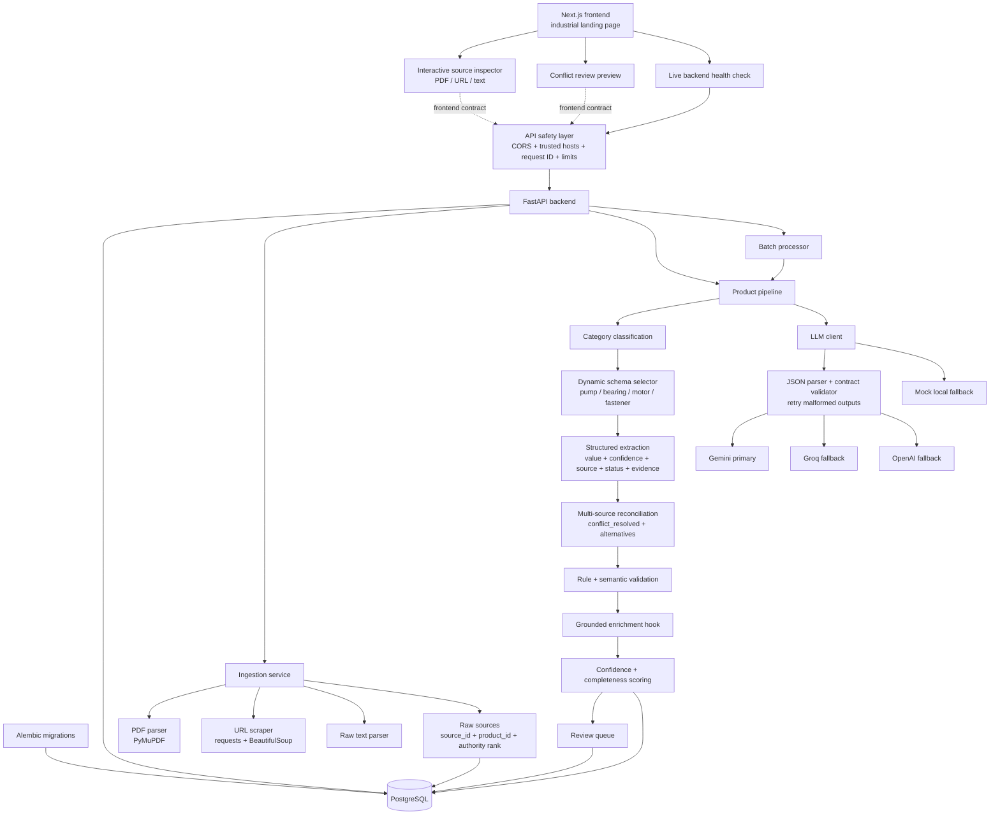

# Ferrox

Backend and frontend for the **Industrial Product Intelligence Platform**: a system that converts scattered industrial product information from PDFs, URLs, and raw catalog text into traceable, validated, enriched structured product data.

The backend lives in `app/`. The frontend landing page and future app shell live in `frontend/` as a Next.js + TypeScript project.

## Frontend Direction

The landing page now uses an industrial inspection visual system derived from selected layouts in the local `front/` design catalog. It includes a generated centrifugal-pump hero image, an interactive PDF/URL/text source inspector, a full extraction pipeline, canonical record evidence, conflict review, the API contract, and a live backend health check. The catalog remains local and ignored; only original Ferrox frontend code is committed to this repository.

## Backend Status

Implemented stages:

1. FastAPI scaffold with SQLAlchemy models for products, raw sources, extracted fields, review queue, and batch jobs.
2. PDF, URL, and raw text ingestion services.
3. LLM pipeline abstraction with live Gemini primary, Groq fallback, OpenAI fallback, and deterministic mock fallback for local tests.
4. Category classification, predefined dynamic schemas, and structured extraction.
5. Multi-source reconciliation with explicit conflict handling and source authority ranking.
6. Rule validation plus semantic LLM validation hook.
7. Grounded enrichment hook.
8. Confidence/completeness scoring and review queue creation.
9. Batch ingestion and processing.
10. Seed data for 16 industrial products with incomplete and conflicting source snippets.
11. Alembic migration setup with an initial PostgreSQL schema migration.
12. API hardening with production API-key enforcement, CORS allowlisting, trusted hosts, request IDs, body/upload limits, security headers, and private-network URL blocking.

## Local Setup

```bash
python3 -m venv .venv
.venv/bin/python -m pip install -e '.[dev]'
cp .env.example .env
docker compose up -d postgres
.venv/bin/python -m alembic upgrade head
.venv/bin/python -m uvicorn app.api:app --reload
```

The API will be available at `http://127.0.0.1:8000`.

Health check:

```bash
curl http://127.0.0.1:8000/api/v1/health
```

To seed mock industrial products:

```bash
.venv/bin/python -m app.seed
```

To create a future migration after model changes:

```bash
.venv/bin/python -m alembic revision --autogenerate -m "describe change"
.venv/bin/python -m alembic upgrade head
```

To run tests:

```bash
.venv/bin/python -m pytest
```

To run the frontend UI:

```bash
cd frontend
npm install
npm run dev
```

The frontend runs at `http://127.0.0.1:3000` and defaults to `http://127.0.0.1:8000/api/v1` for the backend API.

## Environment

All secrets are read from environment variables. Do not commit `.env`.

| Variable | Purpose |
| --- | --- |
| `DATABASE_URL` | Primary PostgreSQL SQLAlchemy URL. |
| `TEST_DATABASE_URL` | Test database URL; defaults to in-memory SQLite for fast tests. |
| `INTERNAL_API_KEY` | Optional API key for mutating endpoints. Leave blank for local-only development. |
| `LLM_PROVIDER_ORDER` | Comma-separated provider order. Default: `gemini,groq,openai`. |
| `GEMINI_API_KEY` | Primary LLM provider key. |
| `GROQ_API_KEY` | First fallback provider key. |
| `OPENAI_API_KEY` | Second fallback provider key. |
| `GEMINI_MODEL` | Gemini model name. Default: `gemini-2.5-flash`. |
| `GROQ_MODEL` | Groq chat model name. Default: `llama-3.3-70b-versatile`. |
| `OPENAI_MODEL` | OpenAI chat model name. Default: `gpt-4o-mini`. |
| `SCRAPER_TIMEOUT_SECONDS` | URL scrape timeout. |
| `MAX_SOURCE_CHARS` | Maximum retained source text per source. |
| `MAX_REQUEST_BYTES` | Maximum accepted HTTP request size. Default: 25 MB. |
| `MAX_PDF_UPLOAD_BYTES` | Maximum accepted PDF payload. Default: 20 MB. |
| `CORS_ORIGINS` | Comma-separated frontend origins allowed to call the API. |
| `TRUSTED_HOSTS` | Comma-separated HTTP host allowlist. |

LLM calls are routed in `LLM_PROVIDER_ORDER`. Each provider is asked for JSON only, parsed defensively, validated against the task contract, retried on malformed output, and then falls through to the next provider if it still fails. If no live keys are configured, the deterministic mock provider keeps local tests and demos working without secrets.

Provider behavior:

| Provider | API style |
| --- | --- |
| Gemini | `generateContent` with `responseMimeType: application/json`. |
| Groq | OpenAI-compatible chat completions with `response_format: {"type": "json_object"}`. |
| OpenAI | Chat completions with `response_format: {"type": "json_object"}`. |

When `INTERNAL_API_KEY` is set, write/process endpoints require either:

```text
X-API-Key: your-key
```

or:

```text
Authorization: Bearer your-key
```

Production mode (`APP_ENV=production`) refuses to start without `INTERNAL_API_KEY`. Every response includes `X-Request-ID`, and clients may send their own request ID for end-to-end tracing.

## Architecture



## Data Model

Core persisted entities:

| Entity | Purpose |
| --- | --- |
| `Product` | Product record, category, dynamic schema, completeness, confidence. |
| `Source` | Raw source content tied to `product_id`; stores type, identifier, parser metadata, authority rank. |
| `ExtractedField` | One canonical field per product field name; includes value, unit, confidence, status, source, evidence, alternatives, validation. |
| `ReviewItem` | Human review queue for conflicts, low confidence, missing required fields, and validation issues. |
| `BatchJob` / `BatchItem` | Batch processing state and item-level payload/errors. |

Structured extracted fields use this exact output shape:

```json
{
  "field_name": "flow_rate",
  "value": "120",
  "unit": "GPM",
  "confidence": 0.78,
  "source_id": "source-uuid",
  "status": "extracted",
  "evidence": "Flow rate 120 GPM",
  "alternatives": [
    {
      "value": "110",
      "unit": "GPM",
      "confidence": 0.78,
      "source_id": "other-source-uuid",
      "source_identifier": "web-page",
      "authority_rank": 3,
      "evidence": "flow rate 110 GPM"
    }
  ],
  "validation": {
    "valid": true,
    "rule_issues": [],
    "semantic_issues": []
  }
}
```

## API Contract

Mutating endpoints are protected when `INTERNAL_API_KEY` is configured. Read endpoints and `/api/v1/health` stay open for basic checks.

### Ingest Raw Text

`POST /api/v1/products/ingest/text`

```json
{
  "product_name": "Aurora End-Suction Pump AXP-200",
  "text": "Manufacturer: Aurora. Model: AXP-200. Flow rate 120 GPM. 50 ft head. 5 HP.",
  "source_identifier": "manual-catalog-snippet"
}
```

### Ingest URL

`POST /api/v1/products/ingest/url`

```json
{
  "product_name": "Aurora End-Suction Pump AXP-200",
  "url": "https://example.com/product"
}
```

### Ingest PDF

`POST /api/v1/products/{product_id}/ingest/pdf`

Multipart form field: `file`.

### Run Pipeline

`POST /api/v1/products/{product_id}/pipeline`

```json
{
  "source_ids": null,
  "stages": null
}
```

Returns product detail with extracted fields, validation state, confidence, completeness, alternatives, and review-triggering statuses.

### Get Product

`GET /api/v1/products/{product_id}`

### List Review Items

`GET /api/v1/reviews?status=open&severity=high&product_id={product_id}&limit=100`

Returns review items for low-confidence values, missing required fields, conflicts, and validation failures.

### Get Review Item

`GET /api/v1/reviews/{review_id}`

### Update Review Item

`PATCH /api/v1/reviews/{review_id}`

```json
{
  "status": "resolved",
  "severity": "medium",
  "reason": "Reviewer accepted corrected value",
  "payload": {
    "reviewed_by": "catalog-ops"
  }
}
```

Allowed review statuses: `open`, `resolved`, `dismissed`.

### Correct Product Field

`PATCH /api/v1/products/{product_id}/fields/{field_name}`

```json
{
  "value": "120",
  "unit": "GPM",
  "confidence": 0.99,
  "evidence": "Reviewer confirmed from manufacturer datasheet",
  "resolve_reviews": true
}
```

This creates or updates the canonical extracted field, marks it `validated`, records `reviewer_corrected` in validation metadata, and resolves open review items for the same product field when `resolve_reviews` is true.

### Create Batch

`POST /api/v1/batches`

```json
{
  "items": [
    {
      "name": "ForgeMax Hex Bolt HX-050",
      "sources": [
        {
          "source_type": "text",
          "source_identifier": "catalog",
          "raw_content": "Manufacturer: ForgeMax. Part number HX-050 bolt. Diameter: 1/2 in. Length: 2 in. Thread: 13 UNC."
        }
      ]
    }
  ]
}
```

### List Batches

`GET /api/v1/batches?status=completed&limit=100`

Returns recent batch summaries.

### Get Batch Detail

`GET /api/v1/batches/{batch_id}`

Returns batch summary plus item-level status, error, `product_id`, and original payload.

### Process Batch

`POST /api/v1/batches/{batch_id}/process`

```json
{
  "include_failed": true
}
```

Processes queued items and, when `include_failed` is true, retries failed items. Processing is synchronous for now but isolated behind a reusable function so it can move to a background worker later.

## Test Result

Latest local run:

```text
20 passed
```
