# Ferrox

Backend and frontend for the **Industrial Product Intelligence Platform**: a system that converts scattered industrial product information from PDFs, URLs, and raw catalog text into traceable, validated, enriched structured product data.

The backend lives in `app/`. The frontend lives in `frontend/` as a Next.js + TypeScript application with public, Clerk authentication, and catalog workspace routes.

## Frontend Direction

The landing page uses an industrial inspection visual system derived from selected layouts in the local `front/` design catalog. The connected `/workspace` adds product/source operations, asynchronous pipeline tracking, citation inspection, human review, multi-sheet catalog import, customer reference-master management, 252-column delivery previews, ground-truth evaluation, semantic retrieval, quality analytics, report export, batch staging, and LLM telemetry. `/login` uses Clerk and passes its bearer token to the FastAPI verifier; legacy Ferrox JWTs and service API keys remain supported. The catalog remains local and ignored; only original Ferrox frontend code is committed to this repository.

## Backend Status

Implemented stages:

1. FastAPI scaffold with SQLAlchemy models for products, raw sources, extracted fields, review queue, and batch jobs.
2. PDF, URL, and raw text ingestion services.
3. LLM pipeline abstraction with live Gemini primary, Groq fallback, OpenAI fallback, and deterministic mock fallback for local tests.
4. Category classification, predefined dynamic schemas, and structured extraction.
5. Multi-source reconciliation with explicit conflict handling and source authority ranking.
6. Rule validation plus semantic LLM validation hook.
7. Grounded enrichment hook.
8. Confidence/completeness scoring and review queue creation.
9. Batch ingestion and processing.
10. Seed data for 16 industrial products with incomplete and conflicting source snippets.
11. Alembic migration setup with an initial PostgreSQL schema migration.
12. API hardening with production API-key enforcement, CORS allowlisting, trusted hosts, request IDs, body/upload limits, security headers, and private-network URL blocking.
13. Product collection and source evidence APIs so PDF, URL, and text sources can share one product record.
14. Selectable pipeline stages with retry-safe candidate extraction and idempotent review queue creation.
15. Persistent pipeline jobs with queued/running/completed/failed states and a separate database-backed worker.
16. Durable PDF storage through a local development backend or private S3-compatible storage, including MinIO, checksums, and download streaming.
17. Truly asynchronous batch jobs with worker-side text, public URL, and base64 PDF ingestion plus retryable item failures.
18. Citation-backed Gemini Google Search enrichment that persists only grounded missing-field values and their source URLs.
19. LLM run telemetry with provider fallback attempts, model/task latency, token usage, configurable cost estimates, and Prometheus metrics.
20. User accounts with expiring JWT access tokens, Argon2 password hashing, reviewer/admin authorization, inactive-account enforcement, and service API-key compatibility.
21. CI for unit tests, real PostgreSQL migrations/constraints, Next.js production builds, container builds, and manually triggered live Gemini/Groq/OpenAI integration tests.
22. Container deployment with release migrations, API/worker separation, Prometheus monitoring, automated encrypted PostgreSQL dumps, retention pruning, and guarded restore tooling.
23. Table-aware PDF extraction with page/table boundaries, typed pump subtype fields, preserved pressure-to-torque rows, component construction details, dimensions, and strict nested-value validation.
24. Adaptive OCR for scanned or image-only PDF pages using PyMuPDF's Tesseract-backed OCR path, with page-level OCR diagnostics and native-text-first cost control.
25. CSV/TSV/semicolon/pipe catalog imports that map explicit text or arbitrary supplier columns into queued product batches with row limits and source lineage.
26. Bounded overlapping document chunks for large-source classification, extraction, embeddings, and chunk-level extraction provenance.
27. Pint-backed unit detection and canonical normalization for flow, pressure, power, dimensions, loads, voltage, speed, and torque.
28. Category-specific engineering range and cross-field validation, including relational pressure/torque table checks and bearing geometry checks.
29. Formal confidence-and-authority weighted voting that groups unit-equivalent values, counts each source once, preserves vote audits, and uses the LLM only for close ties.
30. PostgreSQL pgvector source-chunk embeddings with HNSW cosine search, Gemini embeddings when configured, deterministic local embeddings for development, semantic search, and duplicate detection.
31. Internal catalog RAG that accepts only retrieved chunk IDs as citations, tries catalog evidence before external grounded enrichment, and rejects unsupported answers.
32. Catalog analytics and CSV reporting for quality, coverage, validation, reviews, batches, categories, field status, and provider performance, connected to the Next.js workspace.
33. Native XLSX/XLSM catalog ingestion across every visible worksheet, including offset-header detection, placeholder cleaning, and workbook/sheet/row lineage.
34. Versioned manufacturer/brand, LOV, UOM, decimal/fraction, Faucets, Fittings, and 200-item ground-truth masters with batched loading for large reference files.
35. Exact delivery schemas learned from the ground-truth `Delivery Format` worksheet, including all 252 original customer column names and intentionally blank unsupported fields.
36. Deterministic product title, short, long, invoice, and mobile descriptions with fixed attribute order, approved UOM/fraction rendering, casing rules, and character limits.
37. Manufacturer-owned enrichment policy enforced for internal RAG sources and external citations; marketplace, distributor, reseller, and unapproved-domain citations are rejected.
38. Reproducible ground-truth evaluation with field accuracy, character-limit compliance, LOV compliance, manufacturer accuracy, taxonomy accuracy, unmatched-item penalties, row errors, and CSV export.

## Local Setup

```bash
python3 -m venv .venv
.venv/bin/python -m pip install -e '.[dev]'
# macOS host development only; Docker installs this automatically
brew install tesseract
cp .env.example .env
cp frontend/.env.example frontend/.env.local
docker compose up -d postgres minio minio-init
.venv/bin/python -m alembic upgrade head
.venv/bin/python -m uvicorn app.api:app --reload
```

The API will be available at `http://127.0.0.1:8000`.

Run the pipeline worker in a second terminal:

```bash
.venv/bin/python -m app.worker
```

Health check:

```bash
curl http://127.0.0.1:8000/api/v1/health
```

To seed mock industrial products:

```bash
.venv/bin/python -m app.seed
```

Create or reset the first administrator after setting `BOOTSTRAP_ADMIN_EMAIL` and `BOOTSTRAP_ADMIN_PASSWORD`:

```bash
.venv/bin/python -m app.bootstrap_admin
```

To create a future migration after model changes:

```bash
.venv/bin/python -m alembic revision --autogenerate -m "describe change"
.venv/bin/python -m alembic upgrade head
```

To run tests:

```bash
.venv/bin/python -m pytest
```

## Customer Reference Workflow

Load each workbook through the **Standards** view in the Next.js workspace, or use `POST /api/v1/reference-data/{dataset_type}`. Supported types are `manufacturer`, `lov`, `uom`, `fraction`, `faucets`, `fittings`, and `ground_truth`. Replacing a type makes the new version active but retains the previous version for audit history.

Recommended order:

1. Load manufacturer/brand, LOV, UOM, fraction, Faucets, and Fittings masters.
2. Load `Unilog-Sample_200_Items-Input-vs-Output.xlsx` as `ground_truth`.
3. Import `Sample-1000_Items.xlsx` through `POST /api/v1/imports/catalog` or the Standards view.
4. Process the queued batch, run product pipelines, and generate product deliveries with `POST /api/v1/products/{product_id}/delivery`.
5. Run `POST /api/v1/evaluations` with the active ground-truth dataset ID, then download `/api/v1/evaluations/{evaluation_id}/report.csv`.

The reference files are customer-provided and are not committed to this repository. Until the ground-truth workbook is loaded, delivery generation uses a small core preview schema and returns `quality.schema_ready=false`. Once loaded, every delivery record uses the workbook's exact original column names and validates the expected 252-column count.

To run the frontend UI:

```bash
cd frontend
npm install
npm run dev
```

The frontend runs at `http://127.0.0.1:3000` and defaults to `http://127.0.0.1:8000/api/v1` for the backend API.

## Environment

All secrets are read from environment variables. Do not commit `.env`.

| Variable | Purpose |
| --- | --- |
| `DATABASE_URL` | Primary PostgreSQL SQLAlchemy URL. |
| `TEST_DATABASE_URL` | Test database URL; defaults to in-memory SQLite for fast tests. |
| `INTERNAL_API_KEY` | Optional API key for mutating endpoints. Leave blank for local-only development. |
| `CLERK_SECRET_KEY` | Backend secret used to verify Clerk bearer tokens. |
| `CLERK_PUBLISHABLE_KEY` | Optional backend-visible Clerk project identifier. |
| `JWT_SECRET` | Signing secret for user access tokens. Required in production. |
| `JWT_ISSUER` / `JWT_AUDIENCE` | Token issuer and intended API audience. |
| `ACCESS_TOKEN_EXPIRE_MINUTES` | JWT lifetime. Default: 480 minutes. |
| `BOOTSTRAP_ADMIN_EMAIL` / `BOOTSTRAP_ADMIN_PASSWORD` | One-time administrator bootstrap inputs. |
| `LLM_PROVIDER_ORDER` | Comma-separated provider order. Default: `gemini,groq,openai`. |
| `GEMINI_API_KEY` | Primary LLM provider key. |
| `GROQ_API_KEY` | First fallback provider key. |
| `OPENAI_API_KEY` | Second fallback provider key. |
| `GEMINI_MODEL` | Gemini model name. Default: `gemini-2.5-flash`. |
| `GROQ_MODEL` | Groq chat model name. Default: `llama-3.3-70b-versatile`. |
| `OPENAI_MODEL` | OpenAI chat model name. Default: `gpt-4o-mini`. |
| `ENABLE_GROUNDED_ENRICHMENT` | Enables live Google Search grounding for missing required fields. |
| `GEMINI_GROUNDING_MODEL` | Gemini model used with the Google Search tool. |
| `*_INPUT_COST_PER_MILLION` / `*_OUTPUT_COST_PER_MILLION` | Deployment-owned price inputs used for estimated cost telemetry. |
| `SCRAPER_TIMEOUT_SECONDS` | URL scrape timeout. |
| `MAX_SOURCE_CHARS` | Maximum retained source text per source. |
| `DOCUMENT_CHUNK_CHARS` / `DOCUMENT_CHUNK_OVERLAP_CHARS` | Extraction/classification chunk size and overlap. |
| `ENABLE_PDF_OCR` / `PDF_OCR_*` | Adaptive Tesseract OCR switch, language, resolution, and native-text threshold. |
| `MAX_CATALOG_UPLOAD_BYTES` / `MAX_CATALOG_ROWS` | Catalog-file size and row limits. |
| `MAX_REFERENCE_UPLOAD_BYTES` / `MAX_REFERENCE_ROWS` | Large reference-workbook size and aggregate row limits. |
| `DELIVERY_EXPECTED_COLUMNS` | Expected customer delivery width. Default: 252. |
| `MANUFACTURER_DOMAIN_ALLOWLIST` | Comma-separated manufacturer-owned domains allowed for external enrichment in addition to domains from the manufacturer master. |
| `EMBEDDING_MODEL` / `EMBEDDING_DIMENSIONS` | Gemini embedding model and fixed pgvector width. |
| `EMBEDDING_CHUNK_CHARS` / `EMBEDDING_CHUNK_OVERLAP_CHARS` | Search-index chunk size and overlap. |
| `DUPLICATE_SIMILARITY_THRESHOLD` | Minimum semantic similarity used to flag possible duplicates. |
| `MAX_REQUEST_BYTES` | Maximum accepted HTTP request size. Default: 110 MB to admit the bounded 100 MB reference-workbook route. |
| `MAX_PDF_UPLOAD_BYTES` | Maximum accepted PDF payload. Default: 20 MB. |
| `OBJECT_STORAGE_BACKEND` | `local` for filesystem development or `s3` for S3/MinIO. |
| `LOCAL_STORAGE_PATH` | Private local object directory used by the local backend. |
| `S3_BUCKET` / `S3_ENDPOINT_URL` | S3 bucket and optional S3-compatible endpoint. |
| `S3_ACCESS_KEY_ID` / `S3_SECRET_ACCESS_KEY` | S3 credentials; leave unset to use the AWS credential chain. |
| `S3_SERVER_SIDE_ENCRYPTION` | Server-side encryption mode used for stored PDFs. |
| `CORS_ORIGINS` | Comma-separated frontend origins allowed to call the API. |
| `TRUSTED_HOSTS` | Comma-separated HTTP host allowlist. |
| `WORKER_POLL_SECONDS` | Pipeline worker polling interval. Default: 2 seconds. |
| `BACKUP_INTERVAL_SECONDS` | Delay between scheduled PostgreSQL dumps. Default: one day. |
| `BACKUP_RETENTION_COUNT` | Number of newest object-store dumps retained. Default: 14. |
| `BACKUP_PREFIX` | Private object key prefix for database dumps. |
| `NEXT_PUBLIC_API_BASE` | Browser-visible API base used by the Next.js workspace. |
| `NEXT_PUBLIC_CLERK_PUBLISHABLE_KEY` | Browser-visible Clerk key configured in `frontend/.env.local`. |

LLM calls are routed in `LLM_PROVIDER_ORDER`. Each provider is asked for JSON only, parsed defensively, validated against the task contract, retried on malformed output, and then falls through to the next provider if it still fails. If no live keys are configured, the deterministic mock provider keeps local tests and demos working without secrets.

Provider behavior:

| Provider | API style |
| --- | --- |
| Gemini | `generateContent` with `responseMimeType: application/json`. |
| Groq | OpenAI-compatible chat completions with `response_format: {"type": "json_object"}`. |
| OpenAI | Chat completions with `response_format: {"type": "json_object"}`. |

Human users authenticate with `POST /api/v1/auth/token` and send:

```text
Authorization: Bearer your-jwt
```

`reviewer` accounts can use catalog, ingestion, pipeline, batch, and review APIs. `admin` accounts additionally manage users and inspect LLM telemetry. Automation can still use:

```text
X-API-Key: your-service-key
```

Production mode (`APP_ENV=production`) refuses to start without either `CLERK_SECRET_KEY` or `JWT_SECRET`. Every response includes `X-Request-ID`, and clients may send their own request ID for end-to-end tracing. Local development remains open only when Clerk, JWT, and service-key authentication are all unconfigured.

## Architecture

```mermaid
flowchart TD
    UI["Next.js frontend\nlanding + login + operations workspace"] --> Inspector["Interactive source inspector\nPDF / URL / text"]
    UI --> Workspace["Connected workspace\nproducts / reviews / batches / analytics / operations"]
    UI --> StandardsUI["Standards workspace\nreference masters + delivery + evaluation"]
    Workspace --> Intelligence["Catalog intelligence\nsemantic search + RAG + reports"]
    Workspace --> Guard
    UI --> ReviewUI["Conflict review preview"]
    UI --> HealthUI["Live backend health check"]
    HealthUI --> Guard["API safety layer\nCORS + trusted hosts + request ID + limits"]
    Inspector -. "frontend contract" .-> Guard
    ReviewUI -. "frontend contract" .-> Guard
    Guard --> Auth["Clerk or JWT identity + role authorization\nreviewer / admin / service key"]
    Auth --> API["FastAPI backend"]
    Auth --> Users[("User accounts\nArgon2 password hashes")]
    API --> Products["Product collection API\ncreate + list + search + delete"]
    Products --> SourceAPI["Product source API\nattach + list PDF / URL / text / catalog files"]
    SourceAPI --> Ingest
    API --> DB[("PostgreSQL")]
    Migration["Alembic migrations"] --> DB
    API --> Ingest["Ingestion service"]
    Ingest --> PDF["Adaptive PDF parser\nPyMuPDF native text + tables + Tesseract OCR"]
    PDF --> Objects[("Private object storage\nlocal / S3 / MinIO")]
    Objects --> SourceMeta["Checksum + media metadata\nstorage key on Source"]
    SourceMeta --> DB
    Ingest --> URL["URL scraper\nrequests + BeautifulSoup"]
    Ingest --> Text["Raw text parser"]
    Ingest --> CSV["CSV / TSV catalog importer\ncolumn mapping + queued rows"]
    Ingest --> XLSX["Native multi-sheet XLSX importer\noffset headers + row lineage"]
    Ingest --> Sources["Raw sources\nsource_id + product_id + authority rank"]
    Sources --> DB
    Sources --> Chunk["Bounded overlapping chunks\ncharacter offsets + chunk lineage"]

    API --> JobQueue["Persistent pipeline jobs\nqueued / running / completed / failed"]
    JobQueue --> DB
    Worker["Pipeline worker\nrow claim with skip locked"] --> JobQueue
    Worker --> Pipeline["Selectable product pipeline\nindex / classify / extract / reconcile / validate / enrich / score / deduplicate"]
    API --> Pipeline
    Pipeline --> Classify["Category classification"]
    Classify --> Schemas["Dynamic schema selector\npump / bearing / motor / fastener"]
    Schemas --> Extract["Chunked typed extraction\nscalars + lists + relational rows + evidence"]
    Extract --> Units["Pint unit detection\ncanonical engineering units"]
    Units --> Reconcile["Weighted source voting\nunit equivalence + LLM tie break"]
    Reconcile --> Validate["Engineering ranges + cross-field rules\nLLM semantic validation"]
    Validate --> InternalRAG["Internal catalog RAG\nmanufacturer-owned chunks only"]
    InternalRAG --> Enrich["External Gemini Search fallback\napproved manufacturer domains only"]
    Enrich --> Citations["Citation records\nURL + title + cited text"]
    Citations --> DB
    Enrich --> Score["Confidence + completeness scoring"]
    Score --> Review["Review queue"]
    Score --> DB
    Review --> DB

    Chunk --> Embed["Gemini embedding-001\nlocal deterministic fallback"]
    Embed --> Vector[("PostgreSQL + pgvector\nHNSW cosine index")]
    Vector --> Search["Semantic search"]
    Search --> InternalRAG
    Search --> Dedupe["Duplicate detection"]
    Dedupe --> Review
    Vector --> DB

    Pipeline --> LLM["LLM client"]
    LLM --> JSON["JSON parser + contract validator\nretry malformed outputs"]
    JSON --> Gemini["Gemini primary"]
    JSON --> Groq["Groq fallback"]
    JSON --> OpenAI["OpenAI fallback"]
    LLM --> Mock["Mock local fallback"]
    LLM --> Telemetry["LLM run telemetry\nlatency + tokens + configured cost"]
    Telemetry --> DB
    Telemetry --> Metrics["Prometheus metrics"]
    API --> Metrics
    Prometheus["Prometheus scraper"] --> Metrics
    Backup["Scheduled pg_dump\nretention pruning"] --> DB
    Backup --> Objects

    API --> BatchQueue["Persistent batch queue\ntext / URL / base64 PDF payloads"]
    BatchQueue --> DB
    Worker --> BatchQueue
    BatchQueue --> Batch["Worker-side source ingestion\nretryable per item"]
    Batch --> Pipeline
    API --> Analytics["Catalog analytics\nquality + coverage + provider performance"]
    Analytics --> DB
    Analytics --> Reports["JSON dashboard + CSV export"]
    Reports --> Intelligence

    StandardsUI --> RefAPI["Reference data API\nversioned XLSX masters"]
    RefAPI --> RefParser["All-sheet parser\nmerged/offset headers + placeholders"]
    RefParser --> Masters[("Reference records\nmanufacturer / LOV / UOM / fractions\nFaucets / Fittings / ground truth")]
    Masters --> Normalize["Deterministic normalization\nmanufacturer + brand + UOM + fractions"]
    Normalize --> Delivery["Customer delivery builder\nexact 252-column schema"]
    Pipeline --> Delivery
    Delivery --> Descriptions["Deterministic descriptions\ntitle / short / long / invoice / mobile"]
    Delivery --> DB
    Masters --> Evaluation["200-item evaluation harness\nfield + limits + LOV + manufacturer + taxonomy"]
    Delivery --> Evaluation
    Evaluation --> Reports
```



## Data Model

Core persisted entities:

| Entity | Purpose |
| --- | --- |
| `Product` | Product record, category, dynamic schema, completeness, confidence. |
| `Source` | Raw source content tied to `product_id`; stores type, identifier, parser metadata, authority rank, object key, size, media type, and SHA-256 checksum. |
| `SourceChunk` | Searchable source segment with source/product lineage, offsets, checksum, embedding model, and 768-dimensional vector. |
| `ExtractedField` | One canonical field per product field name; includes value, unit, confidence, status, source, evidence, alternatives, validation. |
| `ReviewItem` | Human review queue for conflicts, low confidence, missing required fields, and validation issues. |
| `BatchJob` / `BatchItem` | Batch processing state and item-level payload/errors. |
| `PipelineJob` | Durable product pipeline request with selected sources/stages, lifecycle timestamps, and retryable failure state. |
| `Citation` | URL, title, and cited response span supporting one grounded enriched field. |
| `LLMRun` | Provider attempt status, model/task, latency, token usage, estimated cost, and error context. |
| `ReferenceDataset` / `ReferenceRecord` | Versioned workbook metadata and row-level reference records with sheet/row lineage, normalized lookup keys, and exact headers. |
| `ProductDeliveryRecord` | Product output keyed by the active customer's exact delivery columns, plus deterministic descriptions and schema/coverage checks. |
| `EvaluationRun` | Aggregate quality metrics and row/field-level comparison failures against the active ground-truth workbook. |
| `User` | Human account, password hash, active state, last login, and reviewer/admin role. |

Structured extracted fields use this exact output shape:

```json
{
  "field_name": "flow_rate",
  "value": "120",
  "unit": "GPM",
  "confidence": 0.78,
  "source_id": "source-uuid",
  "status": "extracted",
  "evidence": "Flow rate 120 GPM",
  "alternatives": [
    {
      "value": "110",
      "unit": "GPM",
      "confidence": 0.78,
      "source_id": "other-source-uuid",
      "source_identifier": "web-page",
      "authority_rank": 3,
      "evidence": "flow rate 110 GPM"
    }
  ],
  "validation": {
    "valid": true,
    "rule_issues": [],
    "semantic_issues": []
  }
}
```

## API Contract

Catalog endpoints require a reviewer/admin Clerk or Ferrox JWT bearer token when authentication is configured. Health and metrics endpoints remain available for infrastructure probes; a service API key can authenticate automation.

### Authentication And Users

`POST /api/v1/auth/token` accepts OAuth2 password form fields `username` (email) and `password`. `GET /api/v1/auth/me` returns the signed-in user. Admin-only `POST /api/v1/users`, `GET /api/v1/users`, and `PATCH /api/v1/users/{user_id}` manage reviewer/admin accounts and active status.

### Create And List Products

`POST /api/v1/products`

```json
{
  "name": "Aurora End-Suction Pump AXP-200"
}
```

`GET /api/v1/products?search=Aurora&category=Industrial%20Pump&offset=0&limit=50`

Product list responses include category, dynamic schema, confidence, completeness, and timestamps.

### Attach Sources To One Product

`POST /api/v1/products/{product_id}/sources/text`

```json
{
  "text": "Manufacturer: Aurora. Model: AXP-200. Flow rate 120 GPM.",
  "source_identifier": "manual-catalog-snippet"
}
```

`POST /api/v1/products/{product_id}/sources/url`

```json
{
  "url": "https://example.com/product"
}
```

`POST /api/v1/products/{product_id}/sources/pdf` uses multipart field `file`.

`GET /api/v1/products/{product_id}/sources` returns complete retained raw content, parser metadata, source authority, and timestamps for traceability.

`GET /api/v1/products/{product_id}/sources/{source_id}` returns one source.

`GET /api/v1/products/{product_id}/sources/{source_id}/content` streams the original stored PDF. Objects remain private; the API is the access boundary.

### Ingest Raw Text

`POST /api/v1/products/ingest/text`

```json
{
  "product_name": "Aurora End-Suction Pump AXP-200",
  "text": "Manufacturer: Aurora. Model: AXP-200. Flow rate 120 GPM. 50 ft head. 5 HP.",
  "source_identifier": "manual-catalog-snippet"
}
```

### Ingest URL

`POST /api/v1/products/ingest/url`

```json
{
  "product_name": "Aurora End-Suction Pump AXP-200",
  "url": "https://example.com/product"
}
```

### Ingest PDF

`POST /api/v1/products/{product_id}/ingest/pdf`

Multipart form field: `file`.

### Run Pipeline

`POST /api/v1/products/{product_id}/pipeline`

```json
{
  "source_ids": null,
  "stages": ["index", "classify", "extract", "reconcile", "validate", "enrich", "score", "deduplicate"]
}
```

Both properties are optional. Stage subsets run in canonical pipeline order, and omitted `stages` runs the complete pipeline. Returns product detail with raw sources, extracted fields, validation state, confidence, completeness, alternatives, and review-triggering statuses.

### Get Product

`GET /api/v1/products/{product_id}`

The product detail response includes both `sources` and canonical `fields`.
Citation-backed enriched fields include nested `citations`, and product detail also exposes the complete citation collection.

### Queue A Batch

`POST /api/v1/batches` returns `202 Accepted`; the worker processes queued items asynchronously. Text uses `raw_content`, URL uses `url`, and PDF uses base64-encoded `content_base64`. `POST /api/v1/batches/{batch_id}/process` remains available for controlled retries and local testing.

`POST /api/v1/imports/catalog` accepts a multipart CSV or TSV file and returns a queued batch. A `product_name` or `name` column is required; `text`/`raw_content` is optional because other columns are converted into traceable labeled catalog text.

### Semantic Search, Duplicates, And Catalog RAG

`GET /api/v1/search/semantic?q=230%20V%20motor&limit=10` returns ranked source chunks. `GET /api/v1/products/{product_id}/duplicates` groups high-similarity matches by candidate product. Admin-only `POST /api/v1/search/reindex` rebuilds all source vectors.

`POST /api/v1/rag/query` answers against internal catalog chunks and returns the answer, matched chunks, and `ferrox://source-chunks/{id}` citations. Unsupported or uncited answers return `404` rather than an ungrounded response.

### Catalog Analytics And Reports

`GET /api/v1/analytics/catalog` returns catalog totals, quality rates, category/source/field/review/batch breakdowns, engineering validation issues, completeness bands, and provider performance. `GET /api/v1/analytics/catalog.csv` downloads the same report for BI or spreadsheet workflows.

### Operations

`GET /api/v1/health/live` is process liveness. `GET /api/v1/health/ready` checks database readiness. `GET /api/v1/metrics` exposes Prometheus metrics. `GET /api/v1/observability/llm-runs` returns persisted provider attempts and supports `product_id`, `provider`, and `task` filters.

## CI And Deployment

The default GitHub Actions workflow runs fast backend tests, applies the complete migration chain to PostgreSQL 16, verifies PostgreSQL tables and constraints, builds Next.js, and builds both production images. The manually triggered `Live LLM Integration` workflow requires all three provider secrets and makes billable classification calls without falling back to mock output.

For a complete local production topology, set the required values and run:

```bash
docker compose -f docker-compose.production.yml up -d --build
```

This starts release migrations, API, worker, frontend, private PostgreSQL/MinIO, Prometheus, and the backup loop. Production hardening, alerts, secret handling, backup restore, and managed-service guidance are documented in `ops/DEPLOYMENT.md`.

### Delete Product

`DELETE /api/v1/products/{product_id}`

### Queue Pipeline Job

`POST /api/v1/products/{product_id}/pipeline/jobs`

```json
{
  "source_ids": null,
  "stages": ["index", "classify", "extract", "reconcile", "validate", "enrich", "score", "deduplicate"]
}
```

Returns `202 Accepted` with a persistent queued job. The worker claims queued jobs in creation order and records start/completion timestamps or a bounded failure message.

`GET /api/v1/pipeline/jobs?product_id={product_id}&status=queued&limit=100` lists jobs.

`GET /api/v1/pipeline/jobs/{job_id}` returns one job.

`POST /api/v1/pipeline/jobs/{job_id}/process` processes or retries a queued/failed job immediately for local development and operations.

### List Review Items

`GET /api/v1/reviews?status=open&severity=high&product_id={product_id}&limit=100`

Returns review items for low-confidence values, missing required fields, conflicts, and validation failures.

### Get Review Item

`GET /api/v1/reviews/{review_id}`

### Update Review Item

`PATCH /api/v1/reviews/{review_id}`

```json
{
  "status": "resolved",
  "severity": "medium",
  "reason": "Reviewer accepted corrected value",
  "payload": {
    "reviewed_by": "catalog-ops"
  }
}
```

Allowed review statuses: `open`, `resolved`, `dismissed`.

### Correct Product Field

`PATCH /api/v1/products/{product_id}/fields/{field_name}`

```json
{
  "value": "120",
  "unit": "GPM",
  "confidence": 0.99,
  "evidence": "Reviewer confirmed from manufacturer datasheet",
  "resolve_reviews": true
}
```

This creates or updates the canonical extracted field, marks it `validated`, records `reviewer_corrected` in validation metadata, and resolves open review items for the same product field when `resolve_reviews` is true.

### Create Batch

`POST /api/v1/batches`

```json
{
  "items": [
    {
      "name": "ForgeMax Hex Bolt HX-050",
      "sources": [
        {
          "source_type": "text",
          "source_identifier": "catalog",
          "raw_content": "Manufacturer: ForgeMax. Part number HX-050 bolt. Diameter: 1/2 in. Length: 2 in. Thread: 13 UNC."
        }
      ]
    }
  ]
}
```

### List Batches

`GET /api/v1/batches?status=completed&limit=100`

Returns recent batch summaries.

### Get Batch Detail

`GET /api/v1/batches/{batch_id}`

Returns batch summary plus item-level status, error, `product_id`, and original payload.

### Process Batch

`POST /api/v1/batches/{batch_id}/process`

```json
{
  "include_failed": true
}
```

Processes queued batch items and, when `include_failed` is true, retries failed items immediately for local operations. Normal batch execution remains asynchronous through the persistent worker queue.

## Test Result

Latest local run:

```text
63 passed, 4 skipped
```

The skipped tests are the opt-in PostgreSQL and live Gemini/Groq/OpenAI integration suites; CI runs PostgreSQL automatically, while live-provider checks require repository secrets and manual dispatch.
