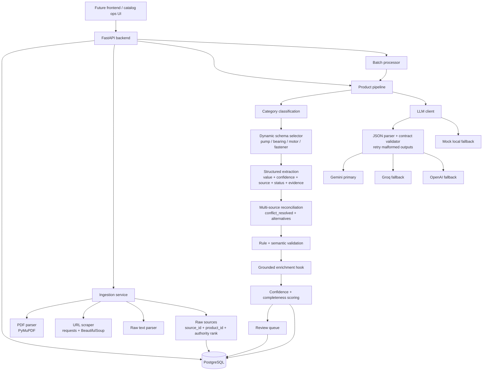

# Ferrox

Backend for the **Industrial Product Intelligence Platform**: a FastAPI service that converts scattered industrial product information from PDFs, URLs, and raw catalog text into traceable, validated, enriched structured product data.

Frontend work is intentionally not included yet. This repository currently exposes the backend APIs and frontend contract only.

## Backend Status

Implemented stages:

1. FastAPI scaffold with SQLAlchemy models for products, raw sources, extracted fields, review queue, and batch jobs.
2. PDF, URL, and raw text ingestion services.
3. LLM pipeline abstraction with live Gemini primary, Groq fallback, OpenAI fallback, and deterministic mock fallback for local tests.
4. Category classification, predefined dynamic schemas, and structured extraction.
5. Multi-source reconciliation with explicit conflict handling and source authority ranking.
6. Rule validation plus semantic LLM validation hook.
7. Grounded enrichment hook.
8. Confidence/completeness scoring and review queue creation.
9. Batch ingestion and processing.
10. Seed data for 16 industrial products with incomplete and conflicting source snippets.

## Local Setup

```bash
python3 -m venv .venv
.venv/bin/python -m pip install -e '.[dev]'
cp .env.example .env
docker compose up -d postgres
.venv/bin/python -m uvicorn app.api:app --reload
```

The API will be available at `http://127.0.0.1:8000`.

To seed mock industrial products:

```bash
.venv/bin/python -m app.seed
```

To run tests:

```bash
.venv/bin/python -m pytest
```

## Environment

All secrets are read from environment variables. Do not commit `.env`.

| Variable | Purpose |
| --- | --- |
| `DATABASE_URL` | Primary PostgreSQL SQLAlchemy URL. |
| `TEST_DATABASE_URL` | Test database URL; defaults to in-memory SQLite for fast tests. |
| `LLM_PROVIDER_ORDER` | Comma-separated provider order. Default: `gemini,groq,openai`. |
| `GEMINI_API_KEY` | Primary LLM provider key. |
| `GROQ_API_KEY` | First fallback provider key. |
| `OPENAI_API_KEY` | Second fallback provider key. |
| `GEMINI_MODEL` | Gemini model name. Default: `gemini-2.5-flash`. |
| `GROQ_MODEL` | Groq chat model name. Default: `llama-3.3-70b-versatile`. |
| `OPENAI_MODEL` | OpenAI chat model name. Default: `gpt-4o-mini`. |
| `SCRAPER_TIMEOUT_SECONDS` | URL scrape timeout. |
| `MAX_SOURCE_CHARS` | Maximum retained source text per source. |

LLM calls are routed in `LLM_PROVIDER_ORDER`. Each provider is asked for JSON only, parsed defensively, validated against the task contract, retried on malformed output, and then falls through to the next provider if it still fails. If no live keys are configured, the deterministic mock provider keeps local tests and demos working without secrets.

Provider behavior:

| Provider | API style |
| --- | --- |
| Gemini | `generateContent` with `responseMimeType: application/json`. |
| Groq | OpenAI-compatible chat completions with `response_format: {"type": "json_object"}`. |
| OpenAI | Chat completions with `response_format: {"type": "json_object"}`. |

## Architecture



## Data Model

Core persisted entities:

| Entity | Purpose |
| --- | --- |
| `Product` | Product record, category, dynamic schema, completeness, confidence. |
| `Source` | Raw source content tied to `product_id`; stores type, identifier, parser metadata, authority rank. |
| `ExtractedField` | One canonical field per product field name; includes value, unit, confidence, status, source, evidence, alternatives, validation. |
| `ReviewItem` | Human review queue for conflicts, low confidence, missing required fields, and validation issues. |
| `BatchJob` / `BatchItem` | Batch processing state and item-level payload/errors. |

Structured extracted fields use this exact output shape:

```json
{
  "field_name": "flow_rate",
  "value": "120",
  "unit": "GPM",
  "confidence": 0.78,
  "source_id": "source-uuid",
  "status": "extracted",
  "evidence": "Flow rate 120 GPM",
  "alternatives": [
    {
      "value": "110",
      "unit": "GPM",
      "confidence": 0.78,
      "source_id": "other-source-uuid",
      "source_identifier": "web-page",
      "authority_rank": 3,
      "evidence": "flow rate 110 GPM"
    }
  ],
  "validation": {
    "valid": true,
    "rule_issues": [],
    "semantic_issues": []
  }
}
```

## API Contract

### Ingest Raw Text

`POST /api/v1/products/ingest/text`

```json
{
  "product_name": "Aurora End-Suction Pump AXP-200",
  "text": "Manufacturer: Aurora. Model: AXP-200. Flow rate 120 GPM. 50 ft head. 5 HP.",
  "source_identifier": "manual-catalog-snippet"
}
```

### Ingest URL

`POST /api/v1/products/ingest/url`

```json
{
  "product_name": "Aurora End-Suction Pump AXP-200",
  "url": "https://example.com/product"
}
```

### Ingest PDF

`POST /api/v1/products/{product_id}/ingest/pdf`

Multipart form field: `file`.

### Run Pipeline

`POST /api/v1/products/{product_id}/pipeline`

```json
{
  "source_ids": null,
  "stages": null
}
```

Returns product detail with extracted fields, validation state, confidence, completeness, alternatives, and review-triggering statuses.

### Get Product

`GET /api/v1/products/{product_id}`

### Create Batch

`POST /api/v1/batches`

```json
{
  "items": [
    {
      "name": "ForgeMax Hex Bolt HX-050",
      "sources": [
        {
          "source_type": "text",
          "source_identifier": "catalog",
          "raw_content": "Manufacturer: ForgeMax. Part number HX-050 bolt. Diameter: 1/2 in. Length: 2 in. Thread: 13 UNC."
        }
      ]
    }
  ]
}
```

## Test Result

Latest local run:

```text
9 passed
```
