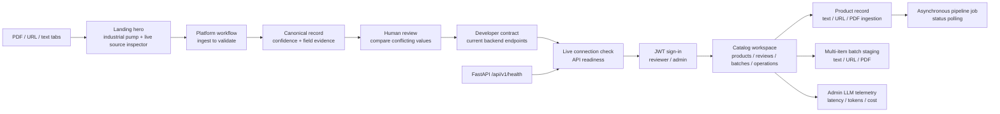

# Ferrox Frontend

The Ferrox frontend is a Next.js + TypeScript product experience for the Industrial Product Intelligence Platform. It includes the public landing page, JWT sign-in, and a connected catalog operations workspace.

## Design Direction

The local `front/` repository is used only as a design catalog. No catalog code or remote history is included in Ferrox, and nothing is pushed to the catalog repository.

The current visual system combines the most relevant ideas from these catalog entries:

- `DFZ9GE6` - AI Factory: product-led hero composition and dark inspection surfaces.
- `SD3TBY5` - Autonomous Data Dashboard: dense technical information and operational status language.
- `U4FIIUM` - Interactive Database Schema: visible data relationships and system structure.
- `7SZDVGF` - Audit Results Dashboard: evidence-first review patterns and clear issue hierarchy.

The result is specific to Ferrox: graphite machinery photography, safety-orange action color, off-white catalog surfaces, source authority labels, field-level evidence, and a working review comparison. The original pump hero image was generated for this project and lives in `public/ferrox-industrial-pump.jpg`.

## Experience Map



## Run

```bash
npm install
npm run dev
```

Open `http://127.0.0.1:3000`. The application workspace is at `/workspace`, and authenticated deployments use `/login`.

## Backend Contract

The frontend uses the current Ferrox API shape, including:

- `GET /api/v1/health`
- `POST /api/v1/products/ingest/text`
- `POST /api/v1/products/{product_id}/pipeline`
- `GET /api/v1/reviews`
- `GET /api/v1/batches`
- `PATCH /api/v1/products/{product_id}/fields/{field_name}`
- `POST /api/v1/auth/token`
- `GET /api/v1/auth/me`
- `POST /api/v1/products/{product_id}/sources/text|url|pdf`
- `POST /api/v1/products/{product_id}/pipeline/jobs`
- `GET /api/v1/pipeline/jobs/{job_id}`
- `POST /api/v1/batches`
- `GET /api/v1/observability/llm-runs`

The browser stores the selected API base in local storage and keeps the JWT access token in session storage. Production deployments should serve the frontend over TLS and use the configured token lifetime.
